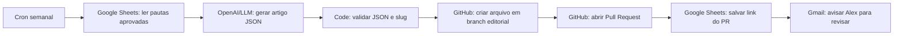

# Automacao editorial ETHOS com n8n

Objetivo: gerar rascunhos de artigos em JSON, revisar antes de publicar e criar pull requests no GitHub sem depender de CMS pago.

## Fonte de verdade

Os artigos publicados ficam em:

```txt
site/src/content/articles/*.json
```

Cada arquivo JSON entra automaticamente no blog e no prerender quando o build roda. Depois de publicar um artigo novo, atualize tambem:

```txt
site/public/sitemap.xml
site/prerender-routes.json
```

## Planilha editorial sugerida

Crie uma planilha `ETHOS - Editorial SEO` com as colunas:

```txt
Status
Keyword principal
Titulo sugerido
Slug
Categoria
Intencao
Publico
Briefing
Links internos
Data sugerida
Arquivo gerado
PR
Observacoes
```

Status recomendados:

```txt
ideia
aprovado
gerando
rascunho_criado
revisado
publicado
descartado
```

Categorias editoriais recomendadas:

```txt
Ferramentas para psicologos
Gestao de consultorio
LGPD e privacidade
Marketing etico
Prontuario e documentos
```

## Workflow n8n

Fluxo barato:



## Prompt base para o node de IA

Use este prompt no n8n e passe os campos da planilha como variaveis.

```txt
Voce e editor SEO do ETHOS, um software para psicologas e psicologos.

Gere um artigo em JSON valido, sem Markdown fora do JSON, seguindo exatamente este formato:

{
  "slug": "",
  "title": "",
  "description": "",
  "category": "",
  "publishedAt": "YYYY-MM-DD",
  "readingTime": "7 min",
  "keywords": [],
  "image": "/uploads/artigos/seo-psicologos.svg",
  "imageAlt": "",
  "author": { "name": "Equipe ETHOS", "role": "Conteudo e produto" },
  "faq": [
    { "q": "", "a": "" }
  ],
  "relatedLinks": [
    { "label": "Software para psicologos", "href": "/software-para-psicologos" },
    { "label": "Blog ETHOS", "href": "/blog" }
  ],
  "sections": [
    { "heading": "", "body": ["", ""] }
  ]
}

Regras:
- Escreva em portugues do Brasil.
- Use tom profissional, claro e etico.
- Nao prometa cura, resultado clinico ou captacao garantida.
- Nao invente normas do CFP/CRP. Quando citar cuidado etico, fale de forma geral.
- Nao colete nem sugira expor dados clinicos sensiveis.
- Inclua naturalmente a keyword principal no title, description, primeiro paragrafo e em ao menos um heading.
- Inclua links internos relevantes para ETHOS e BioHub quando fizer sentido.
- O artigo deve ter 5 a 7 secoes, cada uma com 2 a 4 paragrafos.

Dados da pauta:
Keyword principal: {{$json["Keyword principal"]}}
Titulo sugerido: {{$json["Titulo sugerido"]}}
Slug: {{$json["Slug"]}}
Categoria: {{$json["Categoria"]}}
Intencao: {{$json["Intencao"]}}
Publico: {{$json["Publico"]}}
Briefing: {{$json["Briefing"]}}
Links internos: {{$json["Links internos"]}}
Data sugerida: {{$json["Data sugerida"]}}
```

## Validacao no node Code do n8n

Use um node `Code` depois da IA para garantir que o retorno e JSON e que o arquivo tera nome certo.

```js
const raw = $json.text || $json.output || $json.content || JSON.stringify($json);
const article = typeof raw === "string" ? JSON.parse(raw.replace(/^```json|```$/g, "").trim()) : raw;

if (!article.slug || !article.title || !article.description || !Array.isArray(article.sections)) {
  throw new Error("Artigo incompleto");
}

const filename = `site/src/content/articles/${article.slug}.json`;

return [
  {
    json: {
      filename,
      slug: article.slug,
      articleJson: JSON.stringify(article, null, 2) + "\n",
    },
  },
];
```

## GitHub no n8n

Configuracao recomendada:

- Node `GitHub`
- Resource: `File`
- Operation: `Create or Update`
- Repository: `alexmarroig/Ethos`
- Branch: `editorial/{{$json.slug}}`
- File Path: `{{$json.filename}}`
- File Content: `{{$json.articleJson}}`

Depois use outro node GitHub para abrir PR:

- Title: `docs(site): adicionar artigo {{$json.slug}}`
- Base: `main`
- Head: `editorial/{{$json.slug}}`

## Revisao antes de publicar

No PR, revise:

- Se o texto esta correto e etico.
- Se nao ha promessa clinica.
- Se nao ha dado sensivel.
- Se os links internos existem.
- Se o slug entrou no sitemap e no `prerender-routes.json`.

Depois de aprovar e fazer merge, o Vercel publica e o Search Console pode receber a nova URL.
